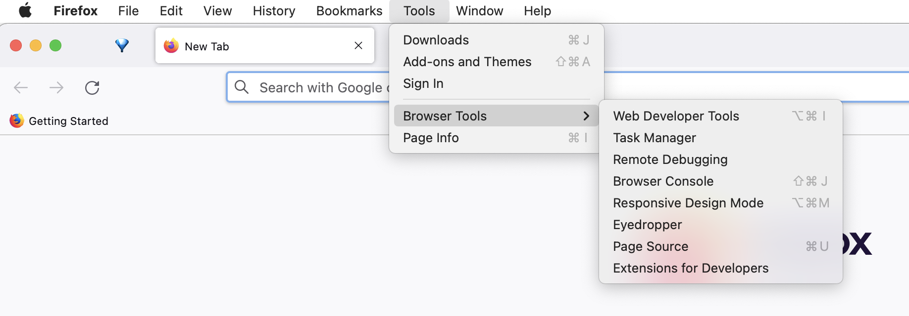
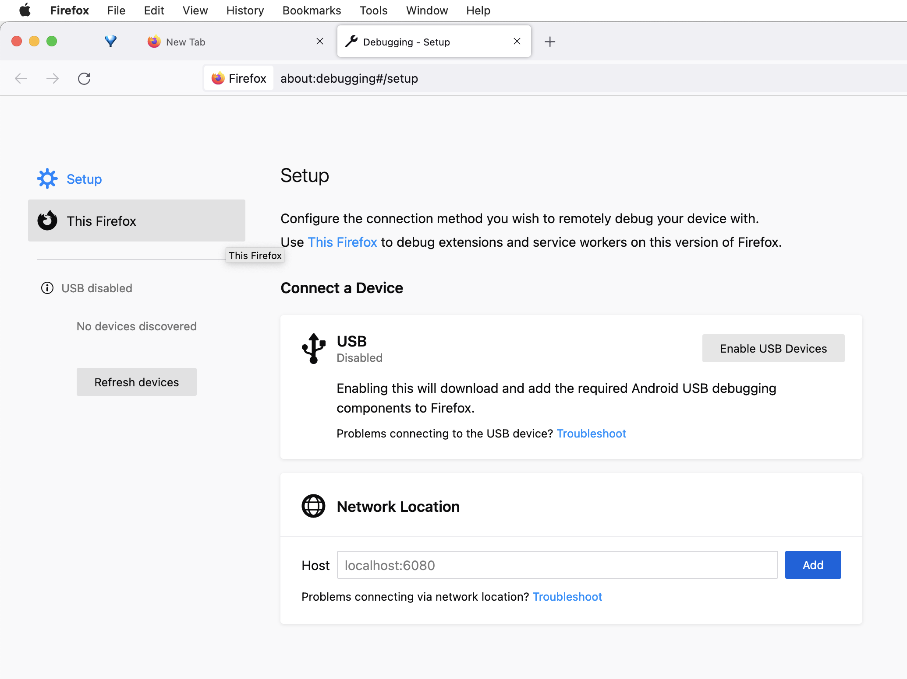
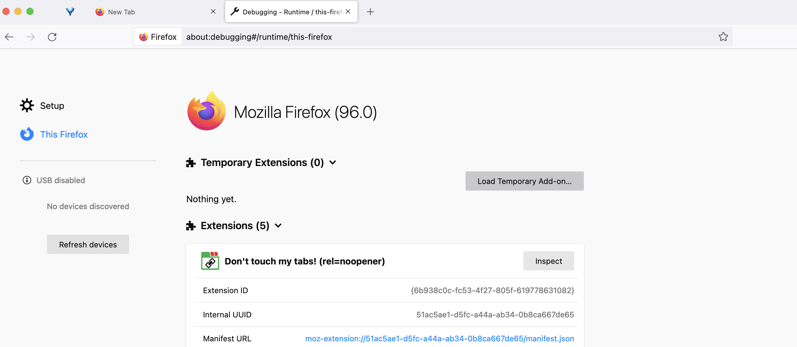
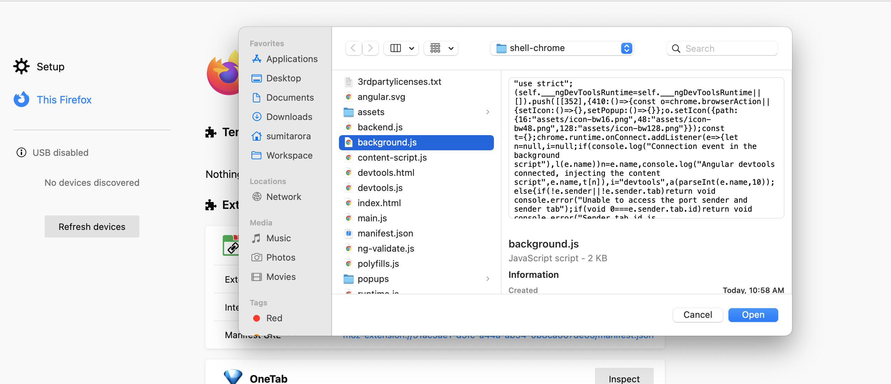
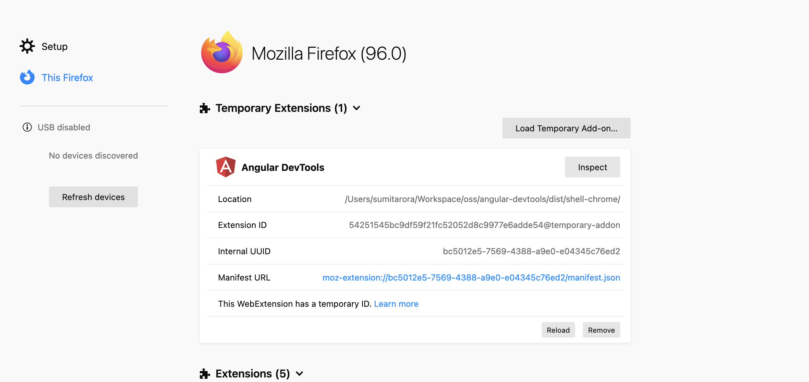
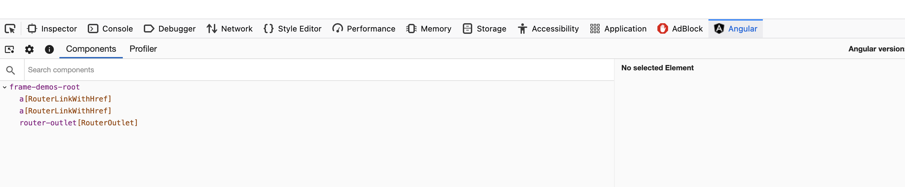

# Installing Angular DevTools in Firefox

To install Angular DevTools in the firefox browser. Follow below steps:-

Open menu item from top bar `Tools -> Browser Tools -> Remote Debugging`.

After clicking `Remote Debugging` click on `This Firefox` option from left navigation. You will see the below screen with list of extensions. Temporary extensions are unreleased extensions loaded in the dev mode.

Click on `Load Temporary Add-on` button to select and load Angular Devtools extension for firefox.

Select any file from `dist -> shell chrome` directory to load extension. If you have not build extension for firefox yet. You can do it using `yarn build:firefox` which will generate build for firefox.

After selecting file and clicking open, you should be able to see Angular DevTools as a Temporary Extension in firefox.

Open any angular application in dev mode and open Firefox Devtools you should see Angular Tab in there.
