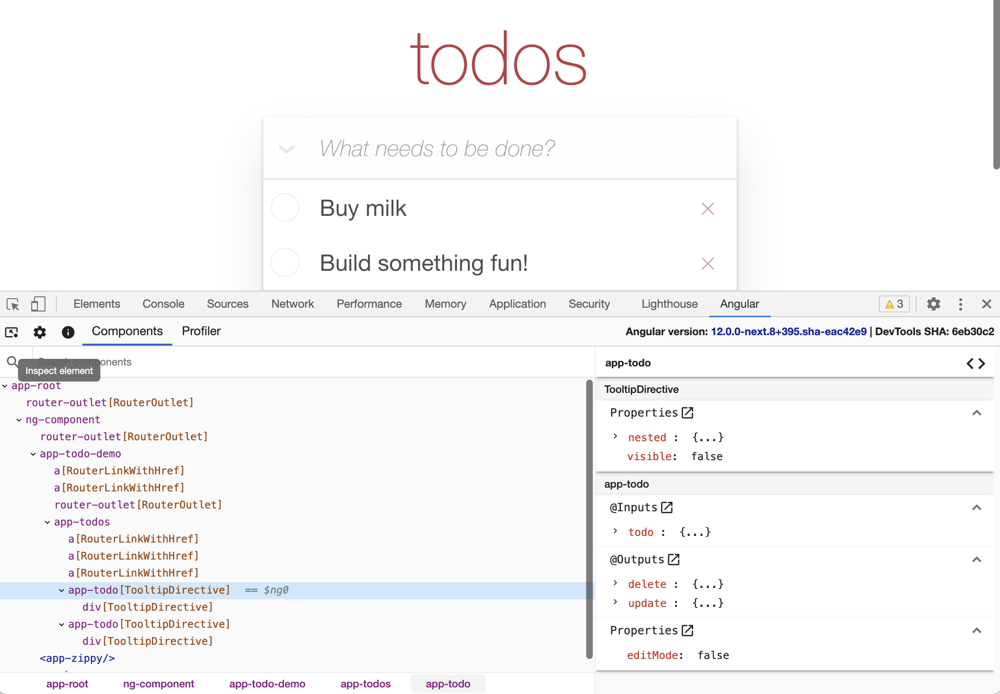
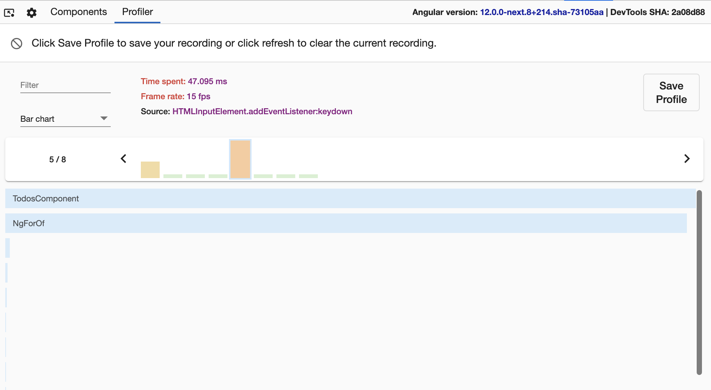

- [Overview](#overview)
  - [Bug reports](#bug-reports)
  - [Debugging your application](#debugging-your-application)
    - [Exploring the structure of the application](#exploring-the-structure-of-the-application)
    - [Viewing properties](#viewing-properties)
    - [Navigate to the host node](#navigate-to-the-host-node)
    - [Navigate to source](#navigate-to-source)
    - [Update property value](#update-property-value)
    - [Access selected component in console](#access-selected-component-in-console)
    - [Selecting DOM Node](#selecting-dom-node)
  - [Profiler](#profiler)
    - [Default profiler view](#default-profiler-view)
    - [Directive details](#directive-details)
    - [Flame graph view](#flame-graph-view)
    - [Debugging OnPush](#debugging-onpush)
    - [Treemap view](#treemap-view)
    - [Import recording](#import-recording)

# Overview

Angular DevTools is a Chrome extension that provides debugging and profiling capabilities for Angular applications. Angular Devtools supports Angular v9 and above, with Ivy enabled.

You can install devtools from Chrome Webstore by searching "Angular Devtools" or can click here.

Once installed, open Chrome DevTools. You should see an "Angular" tab.

When you open it, you'll see two additional tabs:

- [Components](#components) - allows you to explore the components and directives in your application and preview or edit their state.
- [Profiler](#profiler) - allows you to profile your application and understand what is the performance bottleneck during change detection execution.

At the top-right corner of Angular DevTools you'll find what is the version of Angular running on the page as well as the latest commit hash for the extension.

## Bug reports

You can **report issues and feature requests [here](https://github.com/rangle/angular-devtools/issues)**.

When opening an issue, please follow the issue template provided.

If you're reporting an issue with the profiler, export the profiler recording by clicking the "save profile" button, and then attach that export as a file in the issue.

> Make sure while exporting profiler recording, it does not contain any proprietary information.

## Debugging your application

The component tab allows you to explore the structure of your application. You can visualize and inspect the component and directive instances and preview or modify their state. In the next a couple of sections we'll look into how you can use this tab effectively to debug your application.

### Exploring the structure of the application

The component tree displays a hierarchical relationship of the _components_ and _directives_ within your application. When you select a component or directive instance, Angular DevTools presents additional information about it.

In the screenshot above, you can see the component tree of an application.

### Viewing properties

You can click on the individual components or directives to select them and preview their properties. Component properties will get displayed on the right-hand side of the component tree. To navigate in the component tree, you can use the arrows:

- Up and down to select the previous and next nodes.
- Left and right to collapse and expand a node.

To look up for a component or directive by name use the search box at the top. It'll perform a case insensitive exact substring match and highlight the found nodes. To navigate to the next search match, just press "Enter." To navigate to the previous search match, press "Shift + Enter."

### Navigate to the host node

To go to the host element of a particular component or directive, just double-click on it. Chrome DevTools will open the Elements tab and select the associated DOM node.

### Navigate to source

For components, Angular DevTools would also allow you to navigate to the component definition in the source tab. Once you select a particular component, click on the icon at the top-right of the property view (if available):

### Update property value

Like Chrome DevTools, the property view allows you to edit the value of an input, output, or state property. Right-click on the property value. If edit functionality is available for this value type, you'll see a text input. Type the new value and press enter.

### Access selected component in console

As a shortcut in the console, Angular DevTools provides you access to the currently selected component. Just type `$ng0` to get a reference to the instance of the selected component. DevTools keeps references to the last 5 selections in the variables `$ng0`, `$ng1`, `$ng2`, `$ng3`, and `$ng4`.

### Selecting DOM Node

Like Chrome Devtools you can use selection to hover over the rendered components on the page and select the component within the component tree.

## Profiler

The profiler tab allows you to preview the execution time of Angular's change detection and your component's lifecycle hooks.

Currently, Angular DevTools does not allow profiling of component and the directive's outputs.

The profiler allows you to start profiling or import an existing profile. You can start profiling your application by clicking on the circle at the top left.

During profiling, Angular DevTools will capture execution events, such as change detection and lifecycle hook execution. To finish recording, click on the same button.

You can also import an existing recording. Read more about this feature at the [Import recording](#import-recording) section.

### Default profiler view

On the screenshot below, you can find the default view of the profiler once you complete recording.

At the top, you can see a sequence of bars, each one of them symbolizing change detection cycles in your app. The taller a bar is, the longer your application has spent in this cycle. When you select a bar, DevTools will render a bar chart with all the components and directives that it captured during this cycle.

Above the change detection cycle visualization, you can find how much time exactly Angular spent in this cycle. Angular DevTools will also try to estimate the frame drop at this point so that it can indicate when you should consider
optimizing your component tree.

Additionally, Angular DevTools will also indicate what triggered the change detection (i.e., change detection's source).

### Directive details

You can easily notice how much time you spend on the individual components/directives. When you click on a bar, you'll see detailed view about your selection:

On the screenshot above you can find a pie chart showing how much time the specific directive/component spent in change detection versus lifecycle hooks and also, its parent hierarchy, so that you can efficiently allocate it in the
component tree.

### Flame graph view

You can also preview the change detection execution in a flame graph. Each tile in the graph represents an element on the screen at a specific position in the DOM tree.

> For example, if during one change detection cycle at a specific position in the component tree we had `ComponentA`, this component was removed, and on its place Angular rendered `ComponentB`; you'll see both components at the same tile.

Each tile is colored depending on how much time Angular has spent there. DevTools determines the intensity of the color by the time spent relative to the tile where we've spent the most time in change detection.

When you click on a certain tile, you'll see details about it in the panel on the right. Double click on the tile, will zoom it in so you can preview the nested children:

### Debugging OnPush

To preview in which components Angular did change detection, check the "Change detection" checkbox at the top, above the flame graph.

This view will color in green all the tiles in which Angular change detection, and in gray the rest:

### Treemap view

The treemap view is experimental. It aims to show in which component in the component tree you spent the most time during the selected change detection cycle.

### Import recording

Pressing the "Export to JSON" button at the top-left of a recorded profiling session will export it as a JSON file and save it on the disk. Later on, you can import the file in the initial view of the profiler, pressing on the "Choose file" input:

